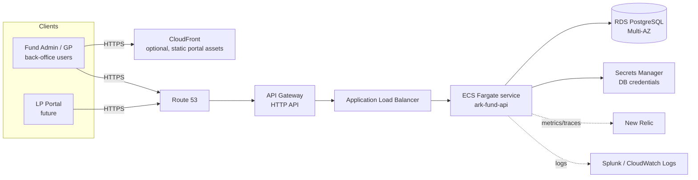
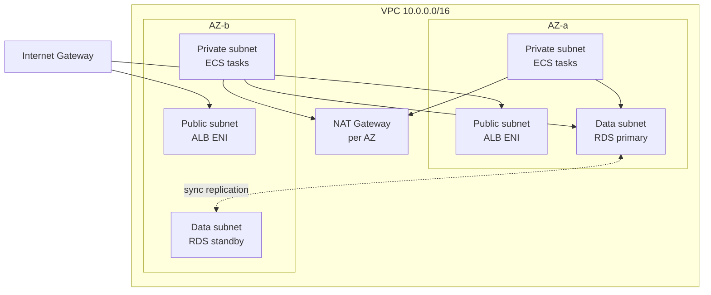

# System Architecture — AWS

Target topology: **Route 53 → API Gateway → ALB → ECS Fargate → RDS PostgreSQL**, sized
from [02-Capacity-Planning.md](02-Capacity-Planning.md). This document covers the
production deployment; local development still runs on `docker compose` per the
[README](../README.md).

## 1. Context diagram

## 2. Why each layer exists

| Layer | Responsibility | Why not skip it |
|---|---|---|
| **Route 53** | DNS, health-check-based failover between regions | Enables the cross-region DR story in [13-Disaster-Recovery-Failover.md](13-Disaster-Recovery-Failover.md) without a client-visible URL change |
| **API Gateway** (HTTP API) | TLS termination edge, request throttling, API key/usage-plan tier for future partner integrations, WAF attachment point | Centralizes rate limiting and auth-token validation outside the app; keeps the Spring app free of edge concerns |
| **ALB** | Internal load balancing across ECS tasks, path-based routing if the API is split later, health checks driving ECS task replacement | API Gateway's native integration to ECS is per-task and doesn't give the same connection draining / target group health semantics as an ALB in front of Fargate |
| **ECS Fargate** | Runs the Spring Boot API as stateless, horizontally scalable tasks | No EC2 fleet to patch; task count scales directly off the ALB request metrics from [02](02-Capacity-Planning.md) |
| **RDS PostgreSQL (Multi-AZ)** | System-of-record storage | Matches the Flyway/Postgres stack already in the codebase; Multi-AZ gives automatic failover (detail in [13](13-Disaster-Recovery-Failover.md)) |

## 3. Network layout

- **Public subnets**: ALB only. Nothing else gets a public IP.
- **Private (app) subnets**: ECS Fargate tasks. Outbound internet via NAT (for pulling
  container images, calling Secrets Manager, sending telemetry) but no inbound path except
  from the ALB security group.
- **Data subnets**: RDS only, reachable solely from the app subnet's security group on
  port 5432. No route to the internet at all.
- Three AZs in production (diagram shows two for readability) — matches the ECS service's
  `desiredCount` spread and the RDS Multi-AZ standby placement.

## 4. Compute sizing (from capacity plan)

| Parameter | Value | Source |
|---|---|---|
| Task CPU / memory | 1 vCPU / 2GB | Baseline for a Spring Boot 3 service under the latency SLOs in [02](02-Capacity-Planning.md) §6 |
| Min tasks | 4 | Floor for AZ redundancy + rolling deploys, not load |
| Desired (steady state) | 6 | Covers ~240 RPS steady state with headroom |
| Max tasks | 16 | Covers 2,000 RPS design target at ~150 RPS/task |
| Autoscaling metric | ALB `RequestCountPerTarget`, target 120 | Target-tracking policy; scale-out cooldown 60s, scale-in cooldown 300s (fast out, slow in — avoids flapping during the quarter-end spike described in [02](02-Capacity-Planning.md) §3) |
| Health check | ALB target group → `GET /actuator/health`, 15s interval, 2 healthy/3 unhealthy thresholds | Spring Boot Actuator, already a dependency in `pom.xml` |

## 5. Database sizing (from capacity plan)

| Parameter | Value | Rationale |
|---|---|---|
| Primary instance | `db.r6g.xlarge` (4 vCPU / 32GB) | Handles the 10% write share plus connection overhead from up to 16 Fargate tasks |
| Read replica(s) | 1–2 × `db.r6g.large` | Absorbs the 90% read share — report endpoints route here (see [08-Database-Design.md](08-Database-Design.md)) |
| Connection pooling | RDS Proxy in front of the primary | 16 tasks × ~10 HikariCP connections = 160 potential connections; RDS Proxy multiplexes these against Postgres's actual connection budget |
| Storage | gp3, autoscaling enabled, start at 100GB | 25M-row projected ledger size (§2 of [02](02-Capacity-Planning.md)) fits comfortably; autoscaling avoids a manual resize event |

## 6. Request path, end to end

```mermaid
sequenceDiagram
    participant U as Client (GP/Admin user)
    participant R as Route 53
    participant G as API Gateway
    participant L as ALB
    participant E as ECS Task (Spring Boot)
    participant D as RDS Primary/Replica

    U->>R: GET /api/v1/clients/{id}/reports/funds/{fundId}
    R->>G: Resolve to nearest healthy region
    G->>G: Validate JWT (future), apply rate limit
    G->>L: Forward request
    L->>E: Route to healthy target
    E->>D: Grouped aggregation query (replica, read-only)
    D-->>E: Rows
    E-->>L: 200 + JSON (RFC 7807 on error)
    L-->>G: Response
    G-->>R: Response
    R-->>U: Response
```

## 7. What's deliberately not in this diagram

- **Caching layer (ElastiCache/Redis)**: portfolio rollups are read-heavy and
  write-invalidated, a natural cache candidate per the take-home README's own "what I'd
  add for production" note — proposed as a phase-2 addition once real read traffic
  patterns are observed, not pre-built speculatively.
- **Message queue (SQS/EventBridge)**: not needed yet because there's no async workflow
  (no capital call notice → LP acknowledgment flow) in this iteration. See
  [04-Implementation-Plan.md](04-Implementation-Plan.md) for where it enters.
- **Service mesh**: one service, no east-west traffic to manage yet.

Deployment mechanics (ECS task definitions, environments, IaC) are in
[12-AWS-Deployment.md](12-AWS-Deployment.md). Failure handling is in
[06-Resiliency-Scalability.md](06-Resiliency-Scalability.md) and
[13-Disaster-Recovery-Failover.md](13-Disaster-Recovery-Failover.md).