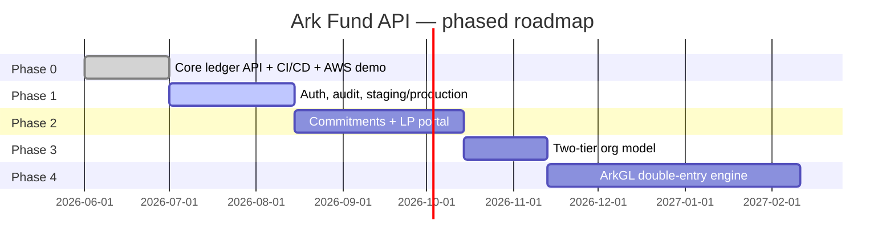

# Implementation Plan

Phased so each stage ships something usable, rather than a big-bang rewrite. Phase 0 is
delivered in this repository today.

## Phase 0 — MVP (delivered)

**Scope:** Client/Fund/Investor CRUD, transaction ledger with the five transaction types,
fund/investor/portfolio reporting with `asOfDate`, tenant isolation, RFC 7807 errors,
OpenAPI docs, Flyway migrations, test suite — plus the CI/CD pipeline and a real AWS
deployment to actually run it on, not just code that compiles locally.

**Why first:** everything else — portal, capital call workflow, GL — reads from or writes
to this ledger, so it has to be correct before anything is built on top of it. And a
take-home claiming "production-grade" needs a live environment and a working pipeline
behind that claim, not just a description of one in a doc.

| Deliverable | Status |
|---|---|
| Domain model + migrations | Done — `V1__initial_schema.sql`, `V2__transaction_types.sql`, `V3__demo_seed_data.sql` |
| CRUD + reporting endpoints | Done — see [07-API-Documentation.md](07-API-Documentation.md) |
| Tenant isolation | Done — `findByIdAndClientId` pattern, tested |
| Unit/integration tests | Done — 16 tests (`mvn test`), H2, no Docker needed — aggregation arithmetic and the tenant boundary |
| Component tests | Done — 5 Cucumber scenarios (`mvn verify -Pcomponent-tests`), real HTTP layer against a real PostgreSQL (`docker compose`'s `db`, not H2's compatibility mode) |
| Live dependency tests | Done — the same 5 scenarios again (`mvn verify -Psmoke-tests`), as a pure black-box HTTP client against an *already-running, already-deployed* instance — `demo` in AWS — proving the live system behaves correctly, not just that it started |
| Code quality & coverage | Done — SonarCloud, wired into CI on every push/PR, reading JaCoCo's coverage report; advisory (`continue-on-error`) for now, not yet a merge gate |
| API documentation | Done — springdoc/Swagger at `/swagger-ui/index.html`, [live](https://524p1owhlc.execute-api.us-east-1.amazonaws.com/swagger-ui/index.html) |
| Circuit breaker | Done — Resilience4j on the reporting endpoints, RDS being this API's one real external dependency (see [06-Resiliency-Scalability.md](06-Resiliency-Scalability.md) §3a) |
| CI/CD pipeline | Done — `.github/workflows/ci-cd.yml`: build/test → image build (ARM64) → deploy to `demo` → automated post-deploy smoke-test gate. GitHub OIDC to AWS, no long-lived keys in the repo. See [05-CICD.md](05-CICD.md) |
| AWS deployment | Done — Terraform-provisioned `demo` environment actually applied and running: ECS Fargate, RDS, internal ALB, API Gateway, CloudFront + S3 frontend, New Relic APM. See [12-AWS-Deployment.md](12-AWS-Deployment.md) and `terraform/README.md` |

## Phase 1 — Production hardening

**Scope:** the gap between "correct" and "operable at Ark's scale," directly answering
the retention risk called out in [01-PRD.md](01-PRD.md) §9. `staging`/`production`
Terraform environments exist (`terraform/environments/`) but aren't applied yet — see
`terraform/README.md`'s "what's deliberately not built yet."

| Item | Detail |
|---|---|
| Authentication | OAuth2/JWT via Cognito; `clientId` resolved from token claim instead of URL path (see [09-Security.md](09-Security.md)) |
| Audit trail | Append-only audit table or Hibernate Envers — who changed what, when, previous value |
| Optimistic locking | `@Version` on `transactions` to prevent lost updates under concurrent edits |
| Idempotency keys | On `POST /transactions`, so a retried request after a client-side timeout can't double-book |
| Structured logging + correlation IDs | Request/response and business-event logging exists today (controllers + services); JSON-formatted logs with a request-scoped correlation ID propagated end to end is still open — see [10-Monitoring-Observability.md](10-Monitoring-Observability.md) |
| `staging`/`production` environments | Apply the existing Terraform for both, wire up the CI/CD jobs already defined but disabled (`ci-cd.yml`'s `deploy-staging`/`deploy-production`, blue/green via CodeDeploy) |

**Why second:** most of this doesn't change the API surface or data model, so it can ship
without coordinating with anything downstream, and it closes the exact gaps a fintech
vendor can't launch without.

## Phase 2 — Commitments & the LP portal surface

**Scope:** the two things the current data model literally cannot represent, both directly
implied by Ark's own numbers ($150B+ committed capital, 70,000+ LP users).

| Item | Detail |
|---|---|
| `Commitment` entity | `(fund_id, investor_id, committed_amount, commitment_date)`. Capital-call transactions draw down against it. |
| Called % / unfunded commitment reporting | New fields on the investor and fund reports: `committedAmount`, `calledToDate`, `unfundedCommitment`, `distributionsToDate` |
| LP-scoped read endpoints | `/api/v1/portal/me/...` — authenticated as the LP, returns only that LP's own positions across funds, never another investor's data even within the same fund |
| Investor-as-user | Either a claim on the existing `Investor` record or a separate `InvestorUser` identity — decision depends on the chosen IdP's multi-tenant user model |

**Why third:** this is additive to the ledger (a `Commitment` row doesn't change how a
`Transaction` is recorded), so phase 0's data doesn't need to be migrated or reinterpreted
— existing transactions simply gain an optional commitment reference.

## Phase 3 — Two-tier org model

**Scope:** reflects "10+ fund administrators" managing "450+ fund managers" — today,
`Client` is a flat tenant; in reality some clients are administrators who service other
clients.

| Item | Detail |
|---|---|
| `Organization` entity | `type: FUND_ADMINISTRATOR \| FUND_MANAGER`, optional `managed_by_org_id` |
| Rollup reporting | A fund administrator can pull a portfolio report across every GP client it services, not just one |
| Access model update | An admin-org user's token grants read access to all managed orgs; a GP-org user's token is scoped to their own org only |

**Why fourth, not earlier:** it's a real schema and access-control change, but nothing in
phases 0–2 needs to be undone to add it — `Client` becomes `Organization` with a type
discriminator, and existing rows default to `FUND_MANAGER` with no parent.

## Phase 4 — ArkGL (double-entry general ledger)

**Scope:** the full accounting engine implied by the product name "ArkGL" — chart of
accounts, journal entries, trial balance, audit-ready financial statements.

**Why last:** this is the largest single piece of scope in the roadmap and the one most
likely to need dedicated accounting-domain expertise beyond what a take-home should
attempt. The current `Transaction` ledger becomes the *subledger* that posts into the GL,
which is how real fund administration platforms are actually layered — subledger detail
feeds summarized GL entries, not the other way around.

## Sequencing rationale

Each phase is chosen so the previous phase's data model and API contract survive
unchanged — additive columns and new endpoints, not breaking migrations. That's what makes
weeks-not-months onboarding (Ark's own stated differentiator) sustainable as the product
grows, rather than something that only holds true at launch.