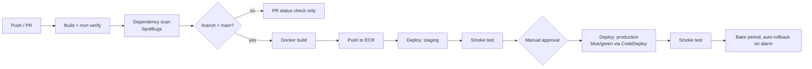

# CI/CD & Execution Plan

Pipeline definition: [`.github/workflows/ci-cd.yml`](../.github/workflows/ci-cd.yml).

## 1. Pipeline stages

## 2. Environments

| Environment | Trigger | Purpose |
|---|---|---|
| PR checks | Every pull request | `mvn verify`, dependency scan, static analysis — must pass before merge |
| Staging | Every push to `main` | Full deploy, smoke-tested, used for pre-release verification and demo |
| Production | Manual approval gate after staging passes | Blue/green via CodeDeploy, auto-rollback on CloudWatch alarm |

## 3. Deployment strategy: blue/green via CodeDeploy

Production uses CodeDeploy's ECS blue/green integration rather than ECS's native rolling
update:

1. CodeDeploy stands up a second ("green") task set alongside the running ("blue") one.
2. The ALB's test listener routes internal traffic to green for a bake period (default 5
   minutes) while CloudWatch alarms are watched (5xx rate, p99 latency, task health).
3. If alarms stay green, the production listener cuts over to the new task set.
4. If any alarm fires, CodeDeploy automatically shifts the listener back to blue — no
   redeploy needed, so rollback is as fast as the alarm evaluation period.
5. Blue task set is kept warm for a configurable termination wait (default 1 hour) before
   being torn down, so a delayed issue still has a fast manual rollback path.

Staging uses a plain ECS rolling update (`minHealthyPercent: 100`, `maxPercent: 200`) —
faster and cheaper, appropriate since staging isn't customer-facing.

## 4. Approval gates

| Gate | Who | Why |
|---|---|---|
| PR review + CI green | Engineering | Standard code review |
| Staging smoke test | Automated | `/actuator/health` must return 200 before production deploy proceeds |
| Production deploy | On-call lead / release manager (GitHub Environment protection rule) | Financial-ledger system — a bad deploy risk is not acceptable to fully automate away at this stage of the platform's maturity |

## 5. Rollback plan

| Scenario | Action |
|---|---|
| Alarm fires during bake period | CodeDeploy auto-rolls back the listener — no human action needed |
| Bad deploy discovered after bake period completes | Re-run the pipeline against the previous known-good image tag (images are immutable, tagged by commit SHA, retained in ECR) |
| Bad database migration | Flyway migrations in this codebase are additive-only by convention (see [08-Database-Design.md](08-Database-Design.md) §4) — a bad migration is fixed forward with a new migration, never `flyway repair` against production |

## 6. Secrets & credentials

- GitHub Actions authenticates to AWS via **OIDC federation** (`aws-actions/configure-aws-credentials`
  with `role-to-assume`) — no long-lived AWS access keys stored in GitHub.
- Database credentials are injected into the ECS task at runtime from **Secrets Manager**,
  never baked into the image or passed as a plain task-definition environment variable.
- Container images are scanned by **ECR image scanning** on push; the pipeline additionally
  runs OWASP Dependency-Check and SpotBugs pre-build (see [09-Security.md](09-Security.md)).

## 7. What's intentionally out of this pipeline (yet)

- **Canary deploys** (gradual % traffic shift rather than bake-then-cutover) — CodeDeploy
  supports this natively (`CodeDeployDefault.ECSCanary10Percent5Minutes` etc.); proposed
  once production traffic volume makes a canary statistically meaningful rather than
  theoretical (see [02-Capacity-Planning.md](02-Capacity-Planning.md) for current traffic
  estimates — worth revisiting once real numbers replace the assumptions).
- **Database migration as a separate pipeline stage** gated independently of app deploy —
  currently Flyway runs on app startup, which is fine at this scale; a dedicated migration
  step becomes worthwhile once migrations need to run ahead of a deploy for a large table.