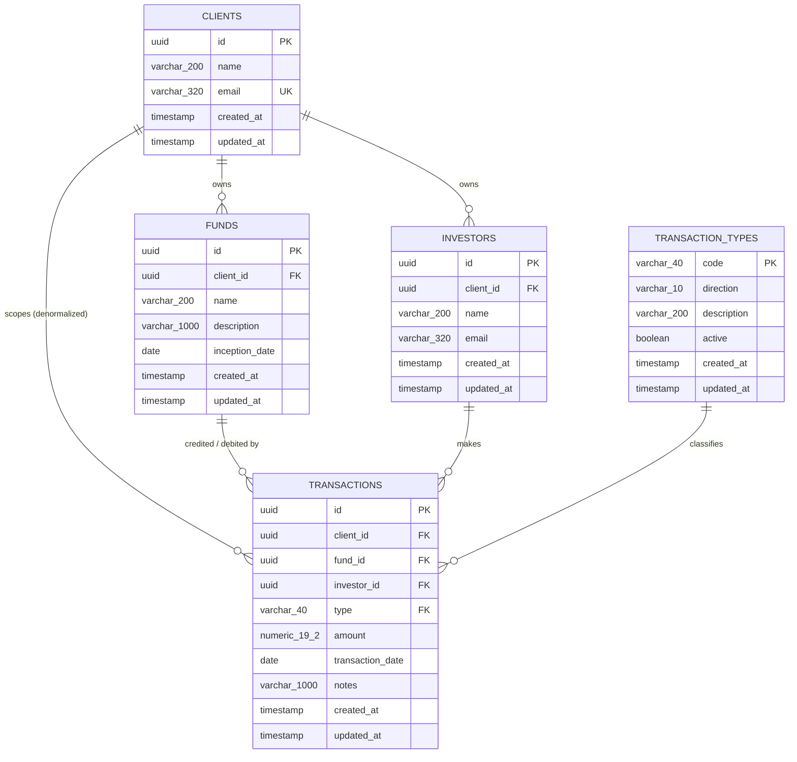

# Database Design

Engine: PostgreSQL (RDS in production, H2 in Postgres-compatibility mode for tests).
Schema owned entirely by Flyway; Hibernate is `ddl-auto: validate` so a drift between
entities and migrations fails startup loudly instead of silently altering tables.

## 1. Entity relationship diagram

A live, styled version of this diagram is also published as a standalone artifact; see
[11-Diagrams.md](11-Diagrams.md).

## 2. Transaction types are governed reference data, not an enum

`transaction_types` holds the five built-in types (`CONTRIBUTION`, `INTEREST_INCOME`,
`DISTRIBUTION`, `GENERAL_EXPENSE`, `MANAGEMENT_FEE`) plus their credit/debit
`direction`, a description, and an `active` flag. `transactions.type` is a foreign key
into it (`fk_transactions_type`), not a fixed application enum.

**Why a table instead of an enum:** the business asked for the ability to add new
transaction types (a new fee category, a new kind of distribution) without a code
deploy. A new type is now an `INSERT` into `transaction_types`, classified as
`CREDIT` or `DEBIT` at insert time — the credit/debit rule that used to live in a Java
`enum` now lives in this one table, and every report and posting path reads it from
there instead of from a compiled constant.

**Why the FK still matters:** a transaction can never carry a type the business hasn't
explicitly defined and classified — the same referential-integrity guarantee the
original enum gave for free, now enforced by the database instead of the compiler.
`TransactionTypeService.require(code)` additionally rejects a **retired** type
(`active = false`) on new postings, while `GET /api/v1/transaction-types` (see
[07-API-Documentation.md](07-API-Documentation.md)) lets clients discover the current
valid set — something Swagger's enum dropdown used to do automatically when `type` was
a fixed Java enum.

**What's deliberately not built:** a public endpoint for clients to create their own
types. Transaction categories are a controlled vocabulary shared across every tenant —
letting one client invent arbitrary ledger categories would break cross-client
reporting consistency and the credit/debit guarantee itself (an uninitialized
direction is a silently wrong balance). New types are added by ops via a migration or
an internal admin action, not client self-service.

## 3. Why no join table for fund ↔ investor

The many-to-many relationship is expressed *through* `transactions` rather than a bridge
table: the association carries a date, amount, and type, none of which a plain join table
can hold. An investor is "in" a fund because there's money behind it — participation is a
derived fact, not a separately maintained one, so there's only one source of truth to keep
consistent.

## 4. Indexing strategy

| Index | Table | Serves |
|---|---|---|
| `idx_transactions_fund_date (fund_id, transaction_date)` | transactions | Fund report aggregation, `asOfDate` filtering |
| `idx_transactions_investor_date (investor_id, transaction_date)` | transactions | Investor report across funds |
| `idx_transactions_client_date (client_id, transaction_date)` | transactions | Portfolio rollup, and every tenant-scoped list query |
| `uq_funds_client_name (client_id, name)` | funds | Enforces per-client (not global) fund name uniqueness, doubles as a lookup index |
| `uq_investors_client_email (client_id, email)` | investors | Same pattern for investor email |
| `transaction_types` primary key (`code`) | transaction_types | Doubles as the FK target for `transactions.type`; the table is small (single digits to low dozens of rows) and is expected to sit fully cached, so no secondary index is needed |

Every reporting query is a single grouped `GROUP BY` aggregation over one of these
composite indexes — a fund with a million transactions still returns a handful of summary
rows, and the per-investor/per-fund breakdowns avoid the classic reporting N+1 (one query
per party) by grouping once.

## 5. Migration strategy

- Flyway migrations are **additive-only** in production: new columns are nullable or
  defaulted, new tables don't touch existing ones, and destructive changes (drop
  column/table) only happen after a deprecation window with the column confirmed unused.
- Migration files are immutable once merged to `main` — a mistake is fixed by a new
  migration, never by editing an already-applied one in place, so Flyway's checksum
  validation never blocks a deploy that already ran against production. `V2__transaction_types.sql`
  runs before `V3__demo_seed_data.sql` specifically so the FK and reference rows exist
  before any transaction — seeded or real — is ever inserted.
- Adding a genuinely new transaction type (as opposed to a schema change) doesn't need a
  migration file at all going forward — it's an `INSERT` into `transaction_types`, which
  is the entire point of moving it out of the enum (§2 above).
- `mvn verify` runs the full migration chain against H2 in Postgres mode on every CI run
  (see [05-CICD.md](05-CICD.md)) — a broken migration fails the pipeline before it ever
  reaches staging.

## 6. Read replica routing

Per the 90/10 read/write split in [02-Capacity-Planning.md](02-Capacity-Planning.md):

| Traffic | Routed to |
|---|---|
| `GET` list/read endpoints, all `/reports/*` | Read replica, via a secondary read-only `DataSource` / Spring `@Transactional(readOnly = true)` routing |
| `POST` / `PUT` / `DELETE` | Primary |

Replica lag is monitored (see [10-Monitoring-Observability.md](10-Monitoring-Observability.md));
a report reflecting a transaction posted milliseconds ago being briefly stale is an
acceptable trade for removing 90% of query volume from the primary — fund accounting
reports are reviewed, not real-time trading data.

## 7. Growth plan for the `transactions` table

Projected ~25M rows after 5 years at current assumed volume (§2 of
[02-Capacity-Planning.md](02-Capacity-Planning.md)). At that size, with the composite
indexes above, queries stay index-driven and this remains a non-issue. The next lever, if
a single client's history starts dominating buffer cache or vacuum time becomes an
operational concern, is **range partitioning by `transaction_date`** (yearly partitions) —
proposed as a trigger-based decision once real telemetry shows it's needed, not built
speculatively against a projection.

## 8. Data types worth calling out

| Column | Type | Why |
|---|---|---|
| `id` (all tables except `transaction_types`) | `UUID`, application-generated | Portable across Postgres and H2; the service layer knows an entity's identity before it's persisted, which matters for tenant-scoped validation before insert |
| `transaction_types.code` | `VARCHAR(40)`, natural key | A readable, stable code (`"CONTRIBUTION"`) is the right identifier for reference data meant to be looked up by name in reports and Swagger — a surrogate UUID would just add an indirection with no benefit |
| `amount` | `NUMERIC(19,2)` | Exact decimal arithmetic — `double`/`float` cannot represent currency exactly, and the drift compounds across a ledger |
| `transaction_date` / `inception_date` | `DATE` | Fund accounting dates are calendar dates, not timestamps — a transaction doesn't have a time-of-day |

## 9. Constraints enforcing business rules at the data layer, not just in code

| Constraint | Rule |
|---|---|
| `ck_transactions_amount_positive CHECK (amount > 0)` | Amount is always positive; sign/direction is derived from `type` in application code (`TransactionType.applySign`) |
| `ck_transaction_types_direction CHECK (direction IN ('CREDIT','DEBIT'))` | A transaction type must be classified one way or the other — no ambiguous or unset direction can exist |
| `fk_transactions_type FOREIGN KEY (type) REFERENCES transaction_types (code)` | A transaction can never carry a type the business hasn't explicitly defined and classified — see §2 |
| `uq_funds_client_name UNIQUE (client_id, name)` | Fund names unique per client, not globally |
| `uq_investors_client_email UNIQUE (client_id, email)` | Investor email unique per client |
| `uq_clients_email UNIQUE (email)` | Client email globally unique |
| FK constraints on every `client_id`/`fund_id`/`investor_id` | Referential integrity — a transaction can never point at a fund or investor that doesn't exist, and application-layer tenant checks additionally prevent a transaction linking a fund and investor from *different* clients (see [09-Security.md](09-Security.md)) |