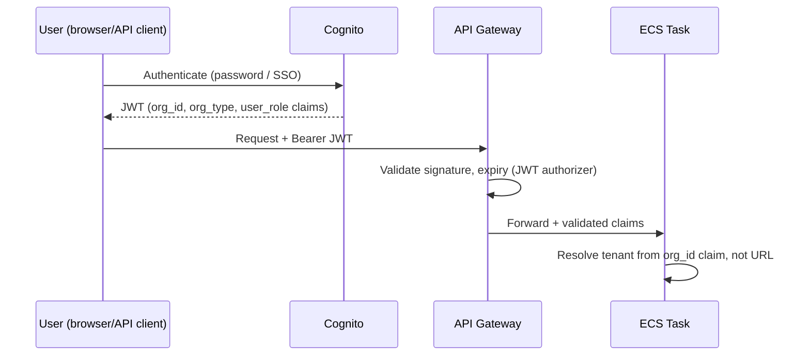

# Security

## 1. Authentication

**Current (take-home scope):** none — `clientId` is a path variable, explicitly
out of scope per the assignment brief.

**Production design:** OAuth2/JWT via Amazon Cognito (or an enterprise IdP behind SAML if
a large fund administrator requires SSO — realistic given "10+ fund admins" servicing
their own client relationships).

The path-based `clientId` in this repo's URLs becomes a **defense-in-depth check**, not
the source of truth: the token's `org_id` claim is authoritative, and a request where the
path's `clientId` doesn't match the token's claim is rejected before it reaches the
service layer.

## 2. Authorization model

| Role | Scope |
|---|---|
| `ADMIN_OPS` (fund administrator staff) | Read/write across every client org that administrator manages (phase 3 two-tier org model, see [04-Implementation-Plan.md](04-Implementation-Plan.md)) |
| `GP_OPS` (fund manager staff) | Read/write within their own org only |
| `LP_USER` (investor, phase 2) | Read-only, scoped to their own investor record across every fund they participate in — never another investor's data, even within a fund they share |

Enforced with method-level security (`@PreAuthorize`) evaluated against the JWT claims,
backed by the same `findByIdAndClientId`-style repository pattern already in place — the
authorization layer changes where the tenant ID comes from, not the isolation mechanism
itself.

## 3. Tenant isolation (already built and tested)

This is the one security property fully implemented today, and it's the property most
directly threatened by a multi-tenant SaaS handling $150B in committed capital across 450+
managers:

- Every repository lookup is `findByIdAndClientId(id, clientId)`, never bare `findById(id)`.
- Requesting another client's resource returns **404, not 403** — a 403 would confirm the
  resource exists under that ID, which is itself an information leak about another
  tenant's data.
- A transaction can never link a fund and an investor belonging to different clients,
  because both are resolved through tenant-scoped loaders before the transaction is
  persisted — tested explicitly (`Cross-tenant transaction creation rejected` in the suite).

## 4. Data protection

| Layer | Control |
|---|---|
| In transit | TLS 1.2+ enforced at API Gateway and the ALB listener; no plaintext HTTP path exists |
| At rest | RDS encryption at rest (KMS-managed key); EBS/ephemeral storage on Fargate tasks encrypted by default |
| Secrets | DB credentials, API keys in Secrets Manager, injected at task startup — never in the image, task definition plaintext, or source control |
| PII | Investor `name`/`email` are the only PII in scope today; classified and access-logged the same way financial fields are, since an investor list is itself sensitive (LP identities are typically confidential) |

## 5. OWASP Top 10 — mapping to this codebase

| Risk | Mitigation |
|---|---|
| Broken access control | Tenant-scoped repository pattern (§3); method-level authz (phase 1) |
| Injection | Spring Data JPA parameterized queries throughout — no string-concatenated SQL anywhere in the codebase |
| Cryptographic failures | TLS everywhere, KMS-encrypted RDS, no custom crypto |
| Insecure design | RFC 7807 errors avoid leaking stack traces; 404-not-403 pattern (§3) is a deliberate insecure-design countermeasure, not an accident |
| Security misconfiguration | Spring Boot Actuator endpoints restricted to `/health` publicly; other actuator endpoints (`/env`, `/beans`) not exposed outside the VPC |
| Vulnerable/outdated components | OWASP Dependency-Check in CI (see [05-CICD.md](05-CICD.md)), ECR image scanning on push |
| Identification/auth failures | Cognito-managed sessions, no custom session/token handling in the app |
| Software/data integrity failures | Signed, immutable container images tagged by commit SHA; Flyway checksum validation prevents a modified migration from silently re-running |
| Logging/monitoring failures | Structured JSON logs with correlation IDs, shipped to Splunk; see [10-Monitoring-Observability.md](10-Monitoring-Observability.md) |
| SSRF | No outbound calls to user-supplied URLs exist in the current API surface; revisit if a future webhook/notification feature accepts a client-supplied callback URL |

## 6. Input validation

- Bean Validation (`spring-boot-starter-validation`) on every DTO — required fields,
  string length bounds matching the DB column widths, positive-amount checks before the
  request ever reaches the database's own `CHECK` constraint (defense in depth, not
  redundancy — the DB constraint is the last line, the DTO validation is the fast/cheap
  first line).
- Validation failures return `400` with a per-field `errors` map (RFC 7807), never a raw
  stack trace or ORM exception message.

## 7. Compliance posture

Ark's positioning ("industry-leading security," servicing regulated fund managers)
implies **SOC 2 Type II** is the relevant bar. What this repo's design already supports
toward that:

| SOC 2 trust principle | Supported by |
|---|---|
| Security | Tenant isolation (§3), encryption (§4), OWASP mapping (§5) |
| Availability | 99.9% SLO, multi-AZ (see [06-Resiliency-Scalability.md](06-Resiliency-Scalability.md)) |
| Processing integrity | `CHECK (amount > 0)`, FK-enforced referential integrity, tested aggregation arithmetic |
| Confidentiality | Cross-tenant isolation, encrypted secrets |
| Privacy | Investor PII scoped and access-controlled (§4) |

Not yet built: the **append-only audit trail** (who changed what, when, previous value) is
the single biggest compliance gap, and it's called out as a phase 1 priority in
[04-Implementation-Plan.md](04-Implementation-Plan.md) precisely because SOC 2 auditors
ask for it directly.