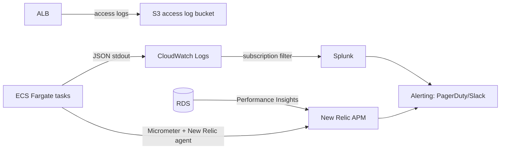

# Monitoring & Observability

Combines the "monitoring" and "observability / New Relic / Splunk / reporting tool" asks —
they're one concern in practice: knowing whether the system is healthy, and being able to
answer why when it isn't.

## 1. The three pillars, and where each lives

| Pillar | Tool | Purpose |
|---|---|---|
| Metrics | New Relic APM + CloudWatch | SLO tracking, autoscaling triggers, alerting |
| Logs | Splunk (via CloudWatch Logs → Splunk forwarder, or Firehose) | Structured JSON logs, correlation-ID tracing across a request, audit-adjacent search |
| Traces | New Relic distributed tracing | Request path from API Gateway → ALB → ECS → RDS, latency breakdown per hop |

## 2. Key metrics and SLOs

Directly tied to the targets set in [02-Capacity-Planning.md](02-Capacity-Planning.md):

| Metric | SLO | Alert threshold |
|---|---|---|
| Report endpoint p95 latency | < 600ms | Page if > 800ms for 5 consecutive minutes |
| CRUD endpoint p95 latency | < 300ms | Page if > 500ms for 5 consecutive minutes |
| 5xx error rate | < 0.1% | Page if > 1% over any 5-minute window |
| Availability | 99.9% monthly | Page on 2 consecutive failed `/actuator/health` checks |
| ECS task count vs. desired | — | Alert if running < desired for > 2 minutes (deploy stuck or capacity issue) |
| RDS CPU / connections | < 80% sustained | Alert at 80%, page at 95% |
| RDS replica lag | < 5s | Alert if > 15s (affects report freshness, §5 of [08-Database-Design.md](08-Database-Design.md)) |
| ECR image scan | — | Block deploy on critical/high CVE (see [09-Security.md](09-Security.md)) |

## 3. Logging

- **Structured JSON logs**, one line per event, shipped to Splunk via a CloudWatch Logs
  subscription filter — human-readable dashboards in New Relic for APM, full-text/field
  search in Splunk for incident investigation.
- **Correlation ID** generated at API Gateway (or accepted from an inbound
  `X-Correlation-Id` header) and propagated through every log line for a request, so a
  single failed report call can be traced end to end across the ALB access log, app log,
  and any downstream DB slow-query log.
- **What's logged:** request method/path/status/latency, tenant ID (`clientId`), and — for
  writes — the entity type and ID mutated. **What's never logged:** transaction amounts or
  investor PII in plaintext log lines; those live in the audit trail
  ([13-Disaster-Recovery-Failover.md](13-Disaster-Recovery-Failover.md)), which has
  stricter access control than general application logs.

## 4. Dashboards

| Dashboard | Audience | Contents |
|---|---|---|
| Platform health (New Relic) | Engineering / on-call | Latency percentiles, error rate, throughput, ECS task count, DB CPU/connections |
| Business reporting (QuickSight or Metabase, fed from the read replica) | Product / Ops leadership | Transactions posted per day, active clients, committed capital tracked, growth against the 450-manager / 70,000-LP baseline |
| Security/audit (Splunk) | Security / Compliance | Auth failures, cross-tenant access attempts (should be zero — any hit is an incident), admin-role actions |

The **business reporting tool** runs against the read replica, not the primary — it's
analytical, not operational, and shouldn't compete with production query load (same
routing principle as report endpoints, [08-Database-Design.md](08-Database-Design.md) §5).

## 5. Alerting and on-call

| Severity | Example | Response |
|---|---|---|
| P1 | 5xx rate > 1%, DB primary unreachable, availability SLO breach | Page on-call immediately, incident channel opened |
| P2 | Latency SLO breach sustained 5+ min, replica lag > 15s | Page on-call, no incident channel unless it escalates |
| P3 | Elevated (not breaching) latency, single task restart | Slack notification, reviewed next business day |

Alert routing: New Relic/CloudWatch alarms → PagerDuty → on-call engineer, with a Slack
mirror for visibility. Runbook links are attached to each alert definition so the
on-call engineer's first step is never "figure out what this means."

## 6. Synthetic monitoring

A scheduled synthetic check (New Relic Synthetics or CloudWatch Synthetics) runs the
README's own example flow every few minutes against production — create-adjacent-safe
reads (`GET /reports/portfolio` against a known seeded client) rather than writes, so it
verifies the full path (Route 53 → API Gateway → ALB → ECS → RDS) without polluting data.

## 7. What good looks like, 90 days after launch

- Every alert has fired at least once in a controlled game-day exercise (see
  [13-Disaster-Recovery-Failover.md](13-Disaster-Recovery-Failover.md) §5), so the first
  time it fires for real isn't also the first time anyone has seen it.
- p95 report latency dashboard shows the quarter-end spike predicted in
  [02-Capacity-Planning.md](02-Capacity-Planning.md) §3, confirming (or correcting) the
  assumption it was based on.
- Zero cross-tenant access attempts logged — the one metric where "boringly zero" is the
  entire point.