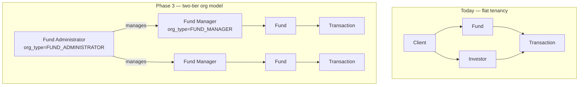
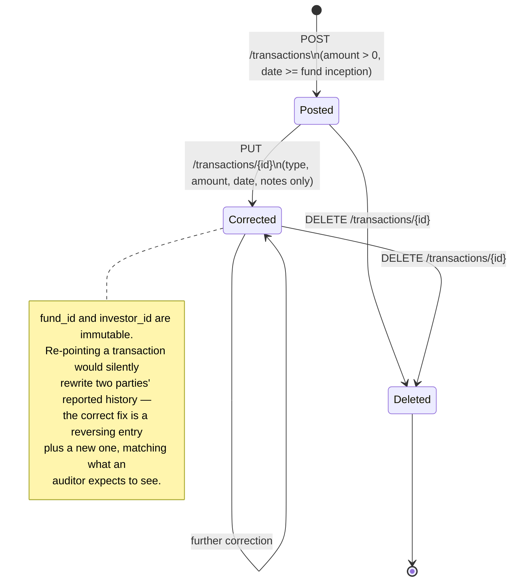
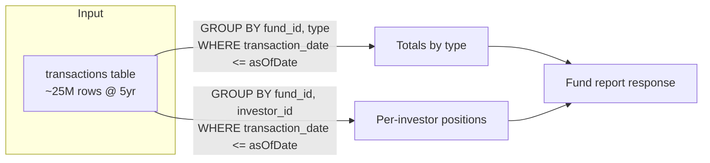

# Diagram Index

All diagrams are written as Mermaid so they render directly in GitHub and stay in version
control as text, not as images that drift from the system they describe. This page is a
map of what's where, plus two diagrams that don't belong inside any single doc.

| Diagram | Type | Location |
|---|---|---|
| Context diagram (users → edge → compute → data) | flowchart | [03-System-Architecture.md](03-System-Architecture.md) §1 |
| Network / VPC layout | flowchart | [03-System-Architecture.md](03-System-Architecture.md) §3 |
| Request path, end to end | sequence | [03-System-Architecture.md](03-System-Architecture.md) §6 |
| Entity relationship diagram | erDiagram | [08-Database-Design.md](08-Database-Design.md) §1 |
| Auth flow | sequence | [09-Security.md](09-Security.md) §1 |
| Observability data flow | flowchart | [10-Monitoring-Observability.md](10-Monitoring-Observability.md) §1 |
| CI/CD pipeline | flowchart | [05-CICD.md](05-CICD.md) §1 |
| Phased roadmap | gantt | [04-Implementation-Plan.md](04-Implementation-Plan.md) §"Sequencing rationale" |

## Tenancy model (today vs. phase 3)

`Client` becomes `Organization` with a `type` discriminator and an optional
`managed_by_org_id` — existing rows default to `FUND_MANAGER` with no parent, so this is a
non-breaking evolution of the current schema (detail in
[04-Implementation-Plan.md](04-Implementation-Plan.md) phase 3).

## Transaction lifecycle

## Reporting aggregation shape

One grouped query per breakdown, not a per-party loop — the mechanism that keeps report
latency inside the SLO in [02-Capacity-Planning.md](02-Capacity-Planning.md) §6 regardless
of how many transactions a fund accumulates.