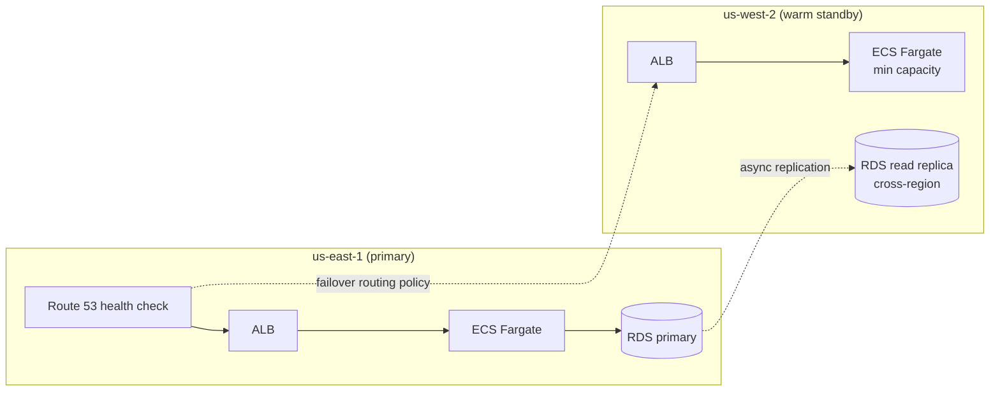

# Disaster Recovery & Failover

How the database — the one truly stateful component in this architecture — stays
recoverable, scalable, and correct through failure. Application-level resilience (ECS task
replacement, autoscaling, circuit breakers) is covered in
[06-Resiliency-Scalability.md](06-Resiliency-Scalability.md); this document is specifically
about the data layer and the recovery procedures around it.

## 1. RDS Multi-AZ failover

| Aspect | Detail |
|---|---|
| Mechanism | Synchronous replication to a standby in a second AZ; RDS automatically promotes the standby and repoints the DNS CNAME on primary failure |
| RPO | ≈ 0 — synchronous replication means no committed transaction is lost |
| RTO | 60–120 seconds — the time for RDS to detect failure and complete promotion; the app reconnects automatically via the unchanged endpoint (HikariCP retries on connection loss) |
| Trigger | Instance failure, AZ outage, or a manually initiated failover (e.g., for OS patching with minimal downtime) |

## 2. Backup and point-in-time recovery

| Aspect | Detail |
|---|---|
| Automated backups | Daily snapshot + continuous transaction log backup, 35-day retention (RDS maximum) |
| Point-in-time recovery | Restore to any second within the retention window — the mechanism for recovering from a bad migration or an application bug that corrupted data, as opposed to infrastructure failure |
| Manual snapshots | Taken before any major migration or schema change, retained indefinitely, independent of the 35-day automated window |
| Backup verification | Quarterly restore drill to a scratch environment, confirming the backup is actually restorable — an untested backup is a hope, not a plan |

## 3. Cross-region DR (warm standby)

| Aspect | Detail |
|---|---|
| Standby posture | Warm — a cross-region RDS read replica stays continuously caught up; ECS runs at minimum capacity (not zero) so a region failover doesn't also wait on cold container/task startup |
| RPO | Seconds to low minutes — bounded by cross-region replication lag, monitored per [10-Monitoring-Observability.md](10-Monitoring-Observability.md) |
| RTO | ~15 minutes — promote the cross-region replica to a standalone writable primary, scale the standby ECS service to production capacity, flip Route 53 |
| Failover trigger | Route 53 health check failure against the primary region's ALB, or manual invocation during a declared regional incident |
| Why warm, not hot (active-active) | Active-active would require solving multi-region write conflicts for a financial ledger — a much larger undertaking than the business case currently justifies for a B2B back-office system with a 99.9% (not 99.99%) SLO. Warm standby gets the real regional-outage protection without that complexity. |

## 4. Failback procedure

After a regional failover, returning to the original primary region is a deliberate,
sequenced operation — not an automatic reversal, because the promoted region now holds the
authoritative data:

1. Confirm the original region's infrastructure is healthy (AWS status, internal checks).
2. Set up the original region's RDS as a **new** read replica of the now-promoted database
   (data flows back, not forward from a stale copy).
3. Once caught up and lag is near zero, schedule a maintenance window.
4. Promote the original region back to primary, repoint replication the other way, flip
   Route 53 back.
5. Post-incident review, feeding back into the runbook and the next game-day scenario (§5).

Failback is intentionally slower and more deliberate than failover — failover is an
emergency response, failback is a planned return to steady state.

## 5. Game-day testing

Scheduled quarterly, escalating in scope:

| Exercise | Validates |
|---|---|
| Kill a single ECS task | Task replacement, ALB health check timing |
| Force an RDS Multi-AZ failover | RTO/RPO claims in §1, app reconnection behavior under real failover (not just theory) |
| Simulate AZ-level network partition | Multi-AZ task/replica spread actually tolerates it |
| Full regional failover drill (staging, then eventually production during a low-traffic window) | Cross-region DR (§3) end to end, including Route 53 propagation time and DNS TTL assumptions |

Every alert defined in [10-Monitoring-Observability.md](10-Monitoring-Observability.md)
should fire during at least one of these exercises before it's trusted to fire correctly
during a real incident.

## 6. Recovering from a *correct-looking but wrong* write

Infrastructure failover doesn't help when the database is healthy but the data is wrong —
a bad correction, a bug that posted the wrong transaction type. This is what the
**append-only audit trail** (phase 1, [04-Implementation-Plan.md](04-Implementation-Plan.md))
is actually for: reconstructing the pre-mutation state of a specific row without a
full-database point-in-time restore, which would roll back every *other* client's correct
transactions along with the one bad row. PITR (§2) is the blunt instrument for
infrastructure-level corruption; the audit trail is the precise instrument for
application-level mistakes — a financial ledger need
s both.